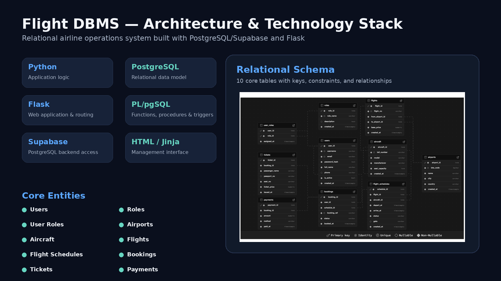
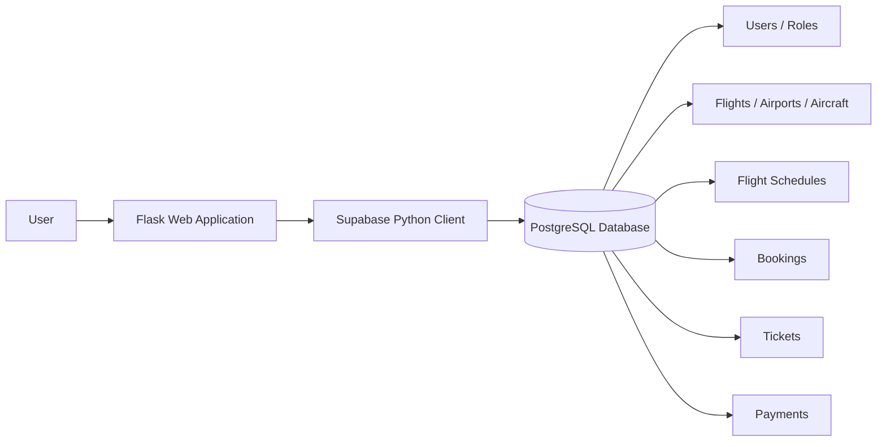
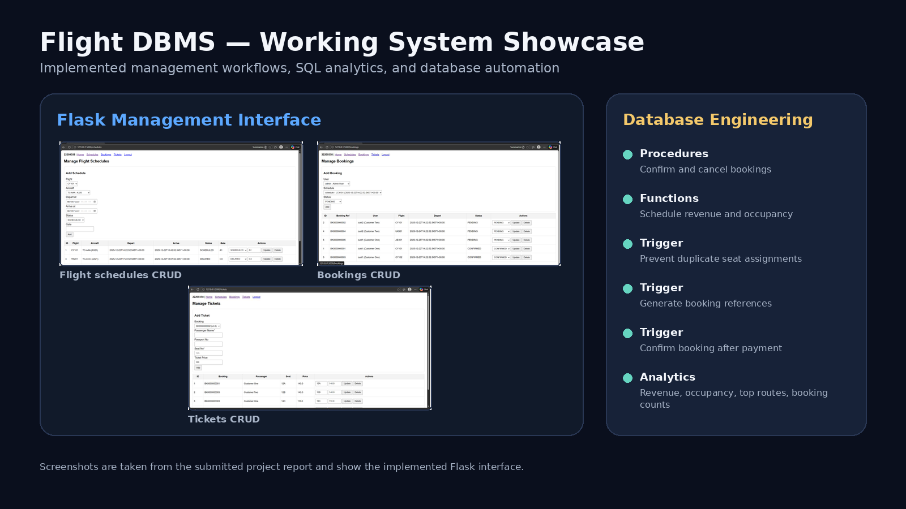

<div align="center">

# ✈️ Flight DBMS

### Flight Management Database System — PostgreSQL / Supabase + Flask

A relational database management project designed to support core airline operations including users, roles, flights, schedules, bookings, tickets, aircraft, airports, and payments.

</div>

<p align="center">
  
</p>

## Overview

**Flight DBMS** was developed for **CMPE 344 — Database Management and Systems II** at Cyprus International University.

The project focuses on designing and implementing a structured airline database, then connecting it to a working Flask interface for operational management.

The system covers:

- User and role management
- Airports and aircraft
- Flights and flight schedules
- Customer bookings
- Ticket issuance
- Payment records
- SQL analytics
- Database procedures, functions, constraints, indexes, and triggers

## Technology Stack

| Layer | Technology |
|---|---|
| Backend | Python, Flask |
| Database | PostgreSQL |
| Database platform/client | Supabase |
| Database programming | SQL, PL/pgSQL |
| Frontend | HTML, Jinja templates |
| Authentication utilities | Werkzeug password hashing |
| Configuration | python-dotenv |
| Version control | Git, GitHub |

The current application dependencies include Flask 3.0.3, Supabase Python 2.6.0, python-dotenv 1.0.1, and Werkzeug 3.0.3.

## System Architecture



The Flask application communicates with the database through the Supabase Python client. The relational schema enforces data integrity using primary keys, foreign keys, check constraints, indexes, and database-side automation.

## Database Design

The implementation contains **10 core tables**:

| Entity | Purpose |
|---|---|
| `users` | User account and profile information |
| `roles` | Application roles |
| `user_roles` | Many-to-many user/role assignments |
| `airports` | Airport and IATA information |
| `aircraft` | Aircraft model, manufacturer, tail number, and capacity |
| `flights` | Flight number, route, and base price |
| `flight_schedules` | Scheduled flight instance, aircraft, time, status, and gate |
| `bookings` | User reservations for scheduled flights |
| `tickets` | Passenger, seat, and ticket-price information |
| `payments` | Booking payment records |

### Integrity Rules

The SQL schema includes constraints such as:

- Unique usernames, emails, IATA codes, aircraft tail numbers, flight numbers, and booking references
- Positive aircraft capacity
- Non-negative flight, ticket, and payment values
- Different departure and destination airports
- Arrival time after departure time
- Controlled values for flight and booking status
- Foreign-key relationships with appropriate cascading behavior
- Indexes on commonly referenced relationship columns

## Database Programming

The project goes beyond basic CRUD by using PostgreSQL functions, procedures, and triggers.

### Procedures

- Confirm a booking
- Cancel a booking

### Functions

- Generate booking references
- Calculate revenue for a flight schedule
- Calculate schedule occupancy

### Triggers

- Automatically create a booking reference
- Prevent duplicate seat assignments on the same flight schedule
- Automatically confirm a non-cancelled booking after a payment is inserted

These database-side rules help keep important business logic close to the data and protect consistency even when application code changes.

## SQL Analytics

The project includes management queries for:

- Flight schedule details
- Total bookings per flight
- Revenue per schedule
- Top routes by tickets sold
- Customers with the most bookings
- Schedule occupancy percentage
- Average ticket price by flight

## Web Application

<p align="center">
  
</p>

A Flask-based interface was implemented for interacting with the database.

### Authentication

- User registration
- Password hashing with Werkzeug
- User login
- Session-protected management pages
- Logout

### Flight Schedules

- Create schedules
- View schedules
- Update schedule status and gate
- Delete schedules

### Bookings

- Create bookings
- View bookings with user and flight information
- Update booking status
- Delete bookings

### Tickets

- Issue tickets
- View ticket details
- Update seat and ticket price
- Delete tickets

## Repository Structure

```text
CMPE-344-Project-FightDBMS/
├── app/
│   ├── app.py
│   ├── requirements.txt
│   └── templates/
├── sql/
│   ├── ddl.sql
│   ├── dml_seed.sql
│   ├── functions_triggers.sql
│   └── queries.sql
├── supabase/
├── assets/
│   ├── architecture-and-stack.png
│   └── working-system-showcase.png
├── docs/
│   └── CMPE_344_Flight_DBMS_Project_Report.pdf
├── .env.example
└── README.md
```

## Running the Flask Application

### 1. Clone the repository

```bash
git clone https://github.com/Abdulraheem-Bawazir/CMPE-344-Project-FlightDBMS.git
cd CMPE-344-Project-FlightDBMS
```

### 2. Create `app/.env`

```env
SUPABASE_URL=your_supabase_url
SUPABASE_SERVICE_ROLE_KEY=your_service_role_key
FLASK_SECRET_KEY=your_flask_secret_key
```

> Never commit real credentials or service-role keys to GitHub.

### 3. Install dependencies

```bash
pip install -r app/requirements.txt
```

### 4. Run

```bash
python app/app.py
```

Open:

```text
http://127.0.0.1:5000/
```

## Project Report

The full university project report is included in:

`docs/CMPE_344_Flight_DBMS_Project_Report.pdf`

## Team

- **Abdulraheem Ba Wazir**
- **Saeed Al Harbi**

## What This Project Demonstrates

This project demonstrates practical experience with:

- Relational database design
- Entity relationships and normalization-oriented schema design
- SQL DDL and DML
- PostgreSQL constraints and indexing
- Complex joins, aggregation, and analytics queries
- PL/pgSQL procedures, functions, and triggers
- Data-integrity enforcement
- Flask backend development
- Supabase/PostgreSQL integration
- Authentication and password hashing
- Full CRUD workflows
- Git-based project organization

---

<div align="center">

**Abdulraheem Bawazir**  
AI / Software Engineering Portfolio

</div>
